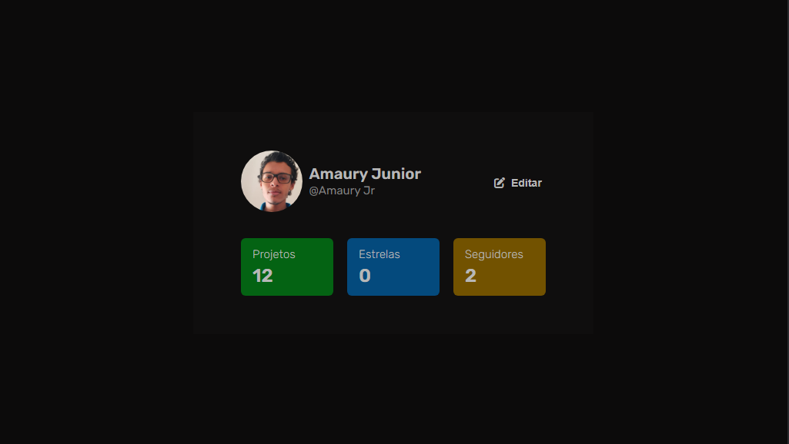
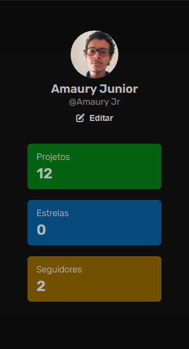

# Projeto do DevChallenge
Nesse Projeto, o objetivo foi criar um <a href="https://devchallenge.vercel.app/challenges/5f0b4acaa5fec43156149044/details" target="_blank">perfil de usuário</a>. Ele foi feito para consolidar e aumentar meus conhecimentos em HTML5 e CSS3.

## Stack utilizada

**Front-end:** HTML e CSS.

### Como ficou no desktop e no mobile

### Olhe como ficou
[Site](https://profile-component-devamauryjr.netlify.app/)

### Devchallenge
<a href="https://devchallenge.now.sh/"> DevChallenge</a> permite que você evolua suas skills como programador! Participe da nossa <a href="https://discord.gg/yvYXhGj">comunidade</a> o/

### Desafio
Seu desafio é criar um componete de um perfil de um usuário! O modelo final está disponível na pasta "design".
Desafio criado por  <a href="https://www.linkedin.com/in/lorenagmontes/">Lorena</a> :)

### Requisitos:
- Sua página exibir o nome e username do usuário. 
- Sua página deverá exibir as informaçes de projetos, estrelas e seguidores de um usuário 
- Sua página deverá ser responsiva

## Dicas

### Cores:
Preto: #0C0B0B 
Cinza: #0F0E0E 
Branco: #B7B7B7 
Verde: #046313 
Azul: #044A7D 
Amarelo: #725200 

### Modelo:
O modelo final desktop está disponível na pasta `./design`

### Icones
Para os ícones, recomendamos que utilize alguma biblioteca, como o Font Awesome

### Tipo de fonte:
- Rubik

## Comunidade DevChallenge
Site: https://www.devchallenge.com.br/  
Discord: https://discord.gg/yvYXhGj  
Linkedin: https://www.linkedin.com/company/devchallenge/ 
Twitter: https://twitter.com/dev_challenge 
Instagram: https://www.instagram.com/devchallenge/ 
